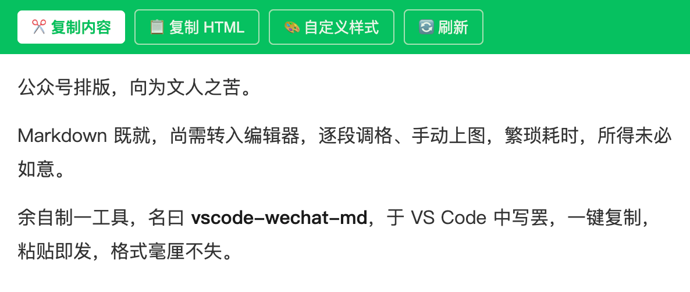

# Image Test



## Special Features

**Bold** and *italic* text

> 引用内容
> 多行引用

- List item 1
- List item 2

1. Numbered item
2. Another item

`inline code`

```
code block
```

## Emoji & HTML

😀 🎉 🚀 ❤️

<span style="color: red;">红色文字</span>
<div style="background: yellow; padding: 10px;">黄色背景块</div>

## Code Block Test

```javascript
function hello(name) {
  console.log(`Hello, ${name}!`);
  return true;
}
```

```css
.selector {
  color: #07C160;
  background: #f6f8fa;
}
```
